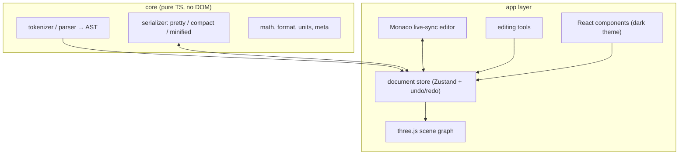

# Architecture

Part Editor v2 is a rewrite of the original Part Editor with a cleaner
separation of concerns, a typed core, and a command-based undo model. It reads
and writes standard LDraw files, plus BrickLink Studio's `.conn` connectivity
files so custom parts can be used in Studio.

## Goals

1. **In-browser** web application and a **standalone downloadable** build
   (packaging decided later; the core stays framework-agnostic).
2. **Live-sync text editor** (Monaco) that bidirectionally syncs with the 3D
   viewport and can **properly format** and **compress** LDraw files.
3. **Fine-grained editing**: direct vertex, transform and CSG editing, with
   every change visible in the text.
4. **Extensive documentation** — technical and user-facing — written alongside
   the code.

## Tech stack

| Concern | Technology |
|---|---|
| UI framework | React 18 |
| Language | TypeScript (strict) |
| Build tool | Vite |
| 3D rendering | Three.js |
| Code editor | Monaco (`@monaco-editor/react`) |
| Layout | `react-resizable-panels` |
| State | Zustand |
| Tests | Vitest |

## Layering



### The core

`src/core/` is dependency-free and unit-tested. It owns:

- **Parsing** text into a typed AST (`src/core/parser.ts`).
- **Serializing** the AST back to text with three formatting modes
  (`src/core/serializer.ts`).
- Shared **math / format / units / meta** primitives.

### The app layer

Built on top of the core in later milestones:

- A **document store** (Zustand) holding the parsed document, the current file,
  selection, and settings. Mutations are recorded in a **branching edit
  history** (`src/lib/history.ts`) — a tree of document snapshots — so undo,
  redo, and jumping to any prior state (diverting history) are uniform. Text
  editor keystrokes are coalesced into a single entry per burst.
- A **renderer** that turns the AST into a Three.js scene (BFC, colors, edges,
  primitive resolution).
- **Editing tools** (punch, erase, CSG, and connector placement) that emit
  commands against the document. Shape drawing tools will return with the
  editor's own primitive format.
- The **Monaco editor** that keeps the text in sync with the document.

## Data flow

1. User types in Monaco → text is debounced and re-parsed → document updated →
   renderer rebuilds the affected geometry.
2. User drags a gizmo in the viewport → a transform command mutates the
   document → serializer regenerates the text → Monaco is updated in place
   (preserving cursor/scroll/folds).
3. Format / minify → serializer produces new text → editor and document update.

## Directory structure

```
part-editor-v2/
├── docs/                  # this documentation
├── src/
│   ├── core/              # pure TS: parser, serializer, math, units, meta
│   ├── lib/               # colors, path resolution, file provider, geometry builder
│   ├── render/            # Three.js scene (LDrawScene)
│   ├── store/             # Zustand document store
│   ├── components/        # React UI
│   ├── styles/            # design tokens (retained visual identity)
│   ├── App.tsx
│   ├── main.tsx
│   └── index.css
├── package.json
├── vite.config.ts
└── vitest.config.ts
```

## Roadmap

| Milestone | Status | Scope |
|---|---|---|
| 1. Foundation | ✅ done | Core parser/AST/serializer + tests + docs skeleton |
| 2. Renderer + live sync | ✅ done | Three.js viewport, grid/camera/lights, colors, primitive resolution, Monaco live sync |
| 3. Editing | ✅ done | Select/move/rotate/scale gizmo, vertex editing, insert/delete parts |
| 4. CSG + BFC | ✅ done | Punch/erase (BSP boolean engine), BFC winding & INVERTNEXT |
| 5. Connectivity | ✅ done | `.conn` read/write, connector placement, stud/hole grids, markers, export |
| 6. Export & packaging | planned | `.dat`/`.conn` export, standalone build |
| 7. Primitive drawing | planned | The editor's own parametric primitive format, specified in its own write-up |

## Design principles

- **Lossless parse.** Every line maps to a command; malformed lines are kept as
  `RawLine` so the editor never drops user text.
- **Deterministic output.** Formatting is idempotent — formatting twice yields
  identical output.
- **Native LDraw coordinates.** The core works in right-handed, Y-up LDU space;
  left-handed conversion is the renderer's responsibility (negate Z).
- **One source of truth.** The document AST is canonical; the text editor is a
  view onto it.
