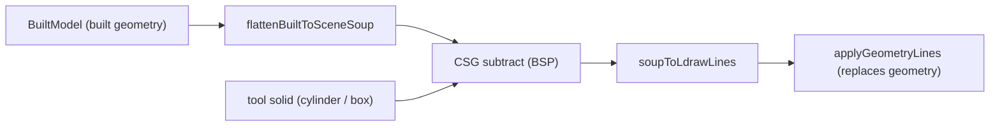

# CSG Punch & Erase (Milestone 4)

The hole (punch) and eraser tools subtract shapes from the part using a
constructive solid geometry (CSG) boolean engine, then write the result back as
plain LDraw triangles.

## Pipeline

1. **Flatten** — `flattenBuiltToSceneSoup` (`src/lib/geometry-builder.ts`)
   collapses the whole part hierarchy into one triangle soup in **scene space**
   (+Y up), carrying each face's resolved color code.
2. **Subtract** — `src/lib/csg.ts` runs a BSP boolean: the target solid minus
   the tool solid. Output is a new triangle soup.
3. **Emit** — `soupToLdrawLines` (`src/lib/punch.ts`) converts each scene-space
   triangle back to a LDraw type-3 line (negate Y, reverse winding).
4. **Commit** — the store's `applyGeometryLines` replaces the active file's
   geometry section (keeping the header meta lines) and re-parses.

## The CSG engine (`src/lib/csg.ts`)

Pure TypeScript, no DOM / no Three.js:

- `CsgSolid` / `CsgPolygon` — polygon soups with unit normals and per-polygon
  LDraw color codes.
- `boxSolid`, `cylinderSolid` — axis-aligned box and Y-axis cylinder tools,
  generated with outward-facing winding.
- `solidFromTriangles`, `solidToTriangles` — soup ↔ solid conversion.
- `union`, `subtract`, `intersect` — the boolean operators, implemented with a
  classic BSP tree (split / clip / invert). Subtracting a tool keeps only the
  target's faces plus the inverted tool's walls, so a through-hole gets
  properly closed walls.

Geometry is authored **outward-wound** (right-hand rule); the engine relies on
consistent orientation to classify inside vs. outside. `boxSolid` orients every
face away from its centroid, so the generators stay correct regardless of face
vertex order.

## Tools

- **Hole** (`kind: 'punch'`) — a cylinder along Y, radius from the variant
  (Axle 6, Pin 4, Bar 3 LDU), tall enough to clear the whole part. A single
  click places it; the result is a through-hole.
- **Eraser** (`kind: 'erase'`) — a box spanning the dragged footprint and the
  full model height, subtracting that region.

Cut faces are emitted with color 16 (inherit), so a single-color part keeps its
color after the boolean.

## Caveats

Punching **re-triangulates** the part: sub-file references (studs, primitives)
are collapsed into type-3 triangles. This is intentional — it mirrors what a
destructive CSG edit means — but it loses parametricity for the edited file.
Undo/redo of the operation is deferred to the command-history milestone.
