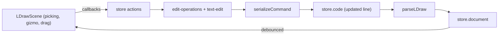

# Editing Tools (Milestone 3)

The viewport is now bidirectional: interactions in the 3D view write precise,
single-line edits back to the LDraw source, and the editor updates in place.

## Architecture

Every edit is a **single-command rewrite**: find the affected line, produce the
new command with `edit-operations`, serialize it using the same whitespace
style as the original line (`serializeCommandLike`), and replace only that line
(`text-edit.replaceLine`). The rest of the document and the editor's
cursor/scroll/folds are preserved.

## Selection

- **Parts** — raycasting the rendered hierarchy maps a hit back to the
  **top-level type-1 line** it belongs to (`userData.topPartLineNumber`), so
  clicking any triangle of a brick selects that brick, not its internal
  primitives. Selected parts get a `BoxHelper` outline.
- **Vertices** — in the **Vertex** tool the viewport renders the active file's
  own geometry as the editable root and places a small marker at every vertex.
  Vertices are **welded by position** (a corner shared by several quads/tris is
  one point), and each marker carries the `aLineIndex` / `aVertexIndex` refs it
  controls. Click selects, Ctrl/Cmd+click toggles multi-select.

## Transform gizmo

Move / Rotate / Scale attach a `TransformControls` gizmo to the selected part's
group. On drag end the group matrix is decomposed back into the LDraw
`position` + 3×3 `matrix` (row-major), and the line is rewritten. Translate
snaps to whole LDU.

Because transforms apply to the part group, rotation/scale pivot on the
sub-file's own origin — the correct LDraw semantics.

## Vertex editing

With the **Vertex** tool, each vertex of the active file's geometry is shown as
a constant-screen-size marker (welded by position). Pointer-down on a marker
selects it (Ctrl/Cmd+click toggles), then drags every selected vertex on a
camera-facing plane. A translate gizmo appears at the selection centroid for
precise axis moves. During the drag both the markers and the editable face
mesh update live; pointer-up commits one `moveVertices` edit that rewrites the
affected source lines. A 120 ms debounced rebuild refreshes the geometry.

`setVertexPosition` handles type-2 line endpoints, triangles, and quads.

## Insert / delete

- Inserting a part appends a new type-1 line (e.g. `3005.dat`) to the main
  model and switches to the Move tool for placement.
- `Delete` / `Backspace` removes the selected part's line; `Escape` clears the
  selection.

## Pure modules

- `src/lib/text-edit.ts` — `replaceLine`, `insertLine`, `removeLine`,
  `appendLine`, `getLine` (all line-number-preserving, LF-normalized).
- `src/lib/edit-operations.ts` — `makeSubfileCommand`, `setSubfileTransform`,
  `setVertexPosition`, `detectFormatMode`, `serializeCommandLike`.

Both are unit-tested, keeping the tricky string manipulation out of the
renderer and store.

## Deferred to later milestones

- **Snap-to-grid during draw** (transforms already snap whole LDU).

CSG punch/erase and BFC winding (previously deferred here) are implemented in
Milestone 4 — see [`csg.md`](csg.md) and [`renderer.md`](renderer.md).
