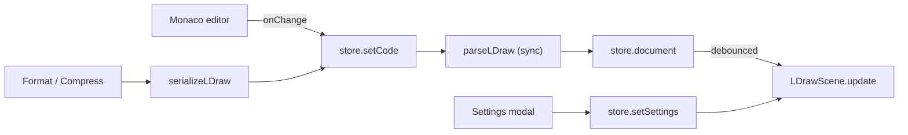

# Live Sync

The editor (Monaco) and the viewport (Three.js) are two views onto one source
of truth: the document store (`src/store/editorStore.ts`, Zustand).

## Text → viewport

1. `EditorPane` calls `setCode(value)` on every keystroke.
2. `setCode` parses synchronously (the parser is pure and cheap) and stores the
   new `document`.
3. `ViewportPane` subscribes to `document` and calls `scene.update(document)`
   after a **120 ms debounce**, so sub-file resolution does not run per
   keystroke.

## Viewport → text (future)

Editing tools (Milestone 3) will mutate the document through **commands**, then
re-serialize to text and push it back into Monaco. Because all edits flow
through the store, the two views can never disagree.

## Format / compress

`Edit → Format Document` and `Edit → Compress Document` run the document
through the serializer (pretty or minified) and write the result back with
`setCode`. The editor updates in place; the viewport follows through the normal
debounced path.

## Avoiding feedback loops

- `setCode` is idempotent for identical text; Monaco's controlled `value`
  comparison prevents redundant writes.
- The serializer is deterministic and idempotent, so formatting never produces
  new content to re-parse.
- `LDrawScene.update` uses a monotonically increasing token; when a newer
  document arrives while an async build is in flight, the older result is
  discarded.

## Debounce and cancellation

Sub-file resolution is the only async step. It is cached (positive and negative
results), so repeated edits that don't change references are cheap.
