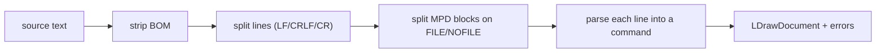

# Parser

Implemented in `src/core/parser.ts` (with line-level helpers in
`src/core/tokenizer.ts`). The parser is **pure and total**: it never throws,
and it never drops content.

## Pipeline



### Line classification

`getLineType(line)` inspects the first character:

- Must be `0`–`5`, followed by whitespace or end-of-line.
- Anything else (`9 …`, `01 …`, blank, etc.) is `null` → `RawLine`.

### Tokenization

`splitTokens` splits on runs of whitespace. Two cases are special:

- **Type 1 file names** may contain spaces — the file name is everything after
  the 14th token, joined with single spaces.
- **Type 0 comments** are free text — handled by `parseComment`, not by token
  splitting.

### Error tolerance

Each geometry line must have the right number of tokens and numeric fields.
If not, the line becomes a `RawLine`:

| Condition | Result |
|---|---|
| Wrong token count | `RawLine` |
| Non-numeric coordinate | `RawLine` |
| Invalid color | `RawLine` |
| Unknown line type | `RawLine` |

When `ParseOptions.tolerant` is `false`, each `RawLine` is also added to the
result's `errors` array. The default is `true` (silent) because a live editor
is expected to see incomplete lines while the user types.

### MPD splitting

`splitBlocks` walks the lines and splits on `0 FILE` / `0 NOFILE`, keeping each
line's original line number. Blank lines are skipped (they carry no information
and the serializer regenerates spacing).

### Description extraction

`extractDescription` returns the first `Description:` meta value, falling back
to the first plain comment line. Keywords that never describe a part (`BFC`,
`STEP`, `!*` bang commands, etc.) are skipped for the fallback.

## API

```ts
parseLine(line: string, lineNumber: number): LDrawCommand
parseLDraw(text: string, options?: ParseOptions): LDrawParseResult
```

`LDrawParseResult` is `{ document, errors }`.
