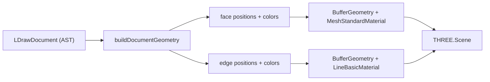

# Renderer

The renderer turns a parsed `LDrawDocument` into an interactive Three.js scene.
It lives in `src/render/ldraw-scene.ts` with support modules in `src/lib/`.

## Coordinate space

- **LDraw** is right-handed with **−Y up**; **Three.js** is right-handed with
  **+Y up**.
- The core keeps everything in native LDraw space (text, AST, matrices). The
  renderer converts to scene space with the mirror `F = diag(1, −1, 1)`:
  - points: `scene = flipY(ldraw)`
  - matrices: `sceneMatrix = F · ldrawMatrix · F` (negate row 2 and column 2)
- Triangle winding is reversed during this conversion so outward normals stay
  outward; faces render with flat shading for correct lighting.

> Left-handed engines also need a Z negation; Three.js only needs the Y flip.

## Pipeline

### `buildDocumentGeometry` (`src/lib/geometry-builder.ts`)

- Walks the main model's commands recursively.
- Expands type-1 sub-files, resolving against the document's own MPD models
  first and the file provider second, with a cycle guard and depth limit.
- Bakes transforms: each sub-file's local matrix is multiplied into the parent,
  and vertices are transformed to world space.
- **Color inheritance**: a color-16 sub-file inherits the parent's effective
  color (16 falls back to tan at the root).
- Quads are split into two triangles (`0,1,2` and `0,2,3`).
- Type-2 and type-5 lines are emitted as edges.
- Unresolvable sub-files are recorded in `missingFiles` and skipped.

Output is a flat triangle soup + edge list with per-vertex **linear-RGB**
colors — nothing else for the scene to do but upload buffers.

### File provider (`src/lib/file-provider.ts`)

The `LDrawFileProvider` interface abstracts "where referenced files come from":

- `HttpLdrawProvider` — fetches from the dev server's `/ldraw` mount with an
  in-memory cache (negative results cached too).
- `MemoryLdrawProvider` — in-memory files, used by tests.

Candidates are generated by `src/lib/path-resolver.ts` in this order:
`p/48` → `p` → `p/8` → `parts` → `UnOfficial/…`. High-resolution primitives
are preferred when both exist, for smoother curves.

### Color pipeline (`src/lib/ldraw-colors.ts`)

1. Resolve the code to 24-bit RGB via the standard palette table, or decode a
   custom `0x2RRGGBB` color from its low 24 bits.
2. Convert sRGB → linear (the exact `0.055 / 2.4` curve Three.js uses).
3. Write linear values as vertex colors.

The renderer sets `outputColorSpace = SRGBColorSpace`, so the final output is
display-correct and matches Studio's look.

## Scene (`LDrawScene`)

| Piece | Details |
|---|---|
| Camera | `PerspectiveCamera` (50° FOV), auto-framed to the model on first build |
| Controls | `OrbitControls` with damping |
| Renderer | `WebGLRenderer`, antialiased, sRGB output, DPR capped at 2 |
| Faces | `MeshStandardMaterial` (`vertexColors`, single-sided when the model declares `0 BFC CERTIFY`, else double-sided) |
| Edges | `LineSegments` + `LineBasicMaterial` (`vertexColors`) |
| Grid | `GridHelper` sized from settings |
| Axes | `AxesHelper` |
| Lights | Ambient + directional, both driven by settings |

`update(document)` rebuilds asynchronously and swaps the model group. A token
guard discards stale results when the document changes mid-build (see
[`live-sync.md`](live-sync.md)).

> **BFC winding** is applied for certified models: faces render single-sided
> (`FrontSide`). The builder tracks the winding sign (a `0 BFC CERTIFY CW`
> file or a `0 BFC INVERTNEXT` sub-file flips it), and a mirrored type-1 matrix
> is handled by Three.js's negative-scale determinant. Uncertsified models
> (`NOCERTIFY` or no declaration) fall back to double-sided rendering. See
> `src/lib/bfc.ts` and the `ModelBuilder` winding pass in
> `src/lib/geometry-builder.ts`.
